# Domain Adaptation 

This package is created to tackle the problem of domain shifts when dealing with two domains of different feature
distributions. In domain adaptation the training data usually consists of labeled source and unlabeled target domain data. 
The final goal is to achieve a low generalization error when testing in the target domain. 

The package supports **pytorch** only.

## Installation

The package is available via PyPI by running the following command:

1. `pip install da`

Alternatively, if you also want to run examples and modify the code, 
clone the repository and install it manually:

1. `git clone git@github.com:CPJKU/da.git`
2. `cd domainadaptation`
3. `pip install -e .`
4. In addition to the package requirements installed automatically in 3), run `pip install -r requirements.txt` to get necessary dependencies for running the examples.

## Introduction

The common paradigm of machine learning is that train and test data stem from the same distribution. This way, we perform
empirical risk minimization on the train data to derive a classifier that we expect to generalize well on our task. Using findings 
from statistical learning theory we can even make assumptions and give bounds on the generalization performance
of the derived classifier.

However, the situation changes when the feature distribution at train and test time is different. Domain Adaptation handles the 
problem when training in a source domain (*X<sub>S</sub>, Y<sub>S</sub>*) and testing in a related, but different target domain (*X<sub>T</sub>, Y<sub>T</sub>*), whereas
the difference lies in the marginal distribution of features **P(X<sub>S</sub>) ≠ P(X<sub>T</sub>)**.

Theoretical Analysis of this problem conducted by Ben-David et al. [13] gives us the following upper bound on the generalization 
error in the target domain at hand:

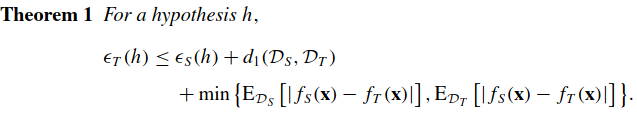

The bound consists of three terms: (1) the generalization error in the source domain, (2) the divergence between source and
target domain (here variation divergence) and (3) the difference between the labeling functions. Ben-David et al. argue that the labeling function difference 
is expected to be small for domain adaptation problems, so the focus lies on (1) and (2).

In correspondance to this theoretical analysis Wilson et al. [1] define the general network setup for learning domain-invariant
features as shown in the figure below. While the **Task Classifier** aims at reducing the source domain error, the **Alignment Component**
minimizes a divergence measure between source and target domain representation. Extracting **domain-invariant** features allows the
**Task Classifier** to perform well when being tested on the labeled target domain data, since it does not suffer from the distributional shift. 

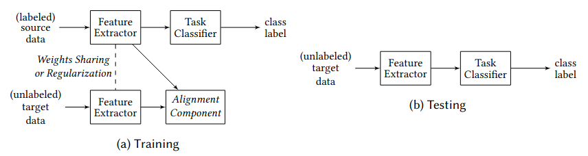

As in [5], we refer to this kind of domain adaption techniques as **feature-based domain adaptation methods**, since the aim
is to align extracted feature representations of source and target domain samples.  

The **main contribution of this domain adaptation package is to provide a collection of prominent realizations of Alignment 
Components** that were proposed over the last years.


## Domain Adaptation Algorithms (Alignment Components)
Domain adaptation aims at adapting the discriminative model learned in a source domain to also perform well in the target domain.
This package implements different **Alignment Components** that can be attached to an arbitrary network layer, which facilitates
learning domain-invariant features. The base network (consisting of **Feature Extractor** and **Task Classifier**) is implemented
outside the package, only the ouput of the **Feature Extractor** network is passed as input (see Section *Usage Guide and API* for an example). This modular setup provides 
flexible handling of domain adaptation in various variants (e.g. unsupervised and semi-supervised domain adaptation or attaching
different kinds of **Alignment Components** to multiple layers). In the following we present the different kinds of implemented
**Alignment Components**:

#### **Maximum Mean Discrepancy (MMD, da_type='mmd')** [11]: 
The aim of this method is to jointly minimize classification error and maximize domain confusion, which leads to a discriminative
and domain-invariant feature representation.

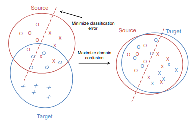

Concretely, the MMD is empirically approximated and implemented by the formula given below:

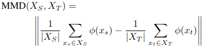

The representation **phi(.)** in our package is calculated as the sum of multiple Gaussian kernels, which is
is commonly done in this context. Also note that *X<sub>S</sub>* and *X<sub>T</sub>* represent a batch of source and target domain
data in this empirical formula.

#### **Central Moment Discrepancy (CMD, da_type='cmd')** [2]: 
Following a similar structure as MMD, CMD uses central moments to calculate the distance between the two domains (source and target) by means of 
order-wise moments differences. However, no expensive computation of a kernel matrix is necessary. Zellinger et al. [2] also 
prove that convergence of probability distributions on compact intervals w.r.t. the CMD metric implies convergence
of the respective random variables.

In pratice, the empirical estimate of the CMD metric is calculated on a batch of source and target samples (X and Y) given
the formula below. The number of moments **K** is an important hyperparameter.
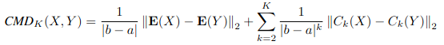

#### **Deep Correlation Alignment (Coral, da_type='coral')** [12]: 

This rather simple, but popular domain adaptation method is concerned with aligning second order statistics of embeddings. 
It can be calculated as the squared matrix Forbenius norm of the covariance matrices of a source and a target domain batch.

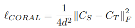

#### **Sliced Wasserstein Distance (SWD, da_type='swd')** [3]: 
The Wasserstein distance is another metric (similar to CMD and MMD) to measure the distance between probability distributions.
It gained lots of popularity as a loss function recently, since it has some advantages compared to other probability
measures, such as taking into account the properties of the underlying geometry of probability spaces and being also
applicable when the two distributions do not share support. The attribute "sliced" refers to the fact that due to complexity reasons
the Wasserstein distance is approximated by linearly projecting the features into 1-D space and solving several one-dimensional
optimal transport problems in this downprojected space.

Notably is also the fact that the SWD is proposed in a specific framework in [3], while our package implements it as a simple
distance function.

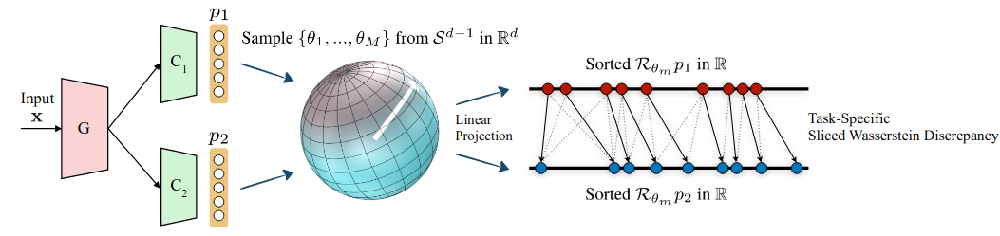


#### **Domain Adversarial Neural Network (DANN, da_type='dann')** [6]:

Opposed to MMD, CMD, Coral and SWD this domain adaptation method is not directly calculating a distance measure on the raw 
embeddings, but introduces a domain classifier that tries to predict from the embeddings whether a sample stems from the source
or the target domain. By using a gradient reversal layer (GRL) between **Feature Extractor** and **Domain Classifier**, the 
**Feature Extractor** is trained to output domain-invariant features that do not allow the **Domain Classifier** to recognize
the corresponding domain. Since **Feature Extractor** and **Domain Classifier** are pitched adversarially against each other, 
DANN is an instance of an adversarial domain adaptation method.

#### 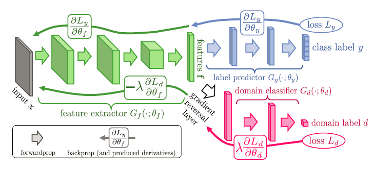

#### **Wasserstein Distance Guided Representation Learning (WDGRL, da_type='wdgrl')** [5]

WDGRL is similar to DANN by using an adversarial **Alignment Component** and similar to **SWD** in the sense that it approximates
the **Wasserstein distance**. 

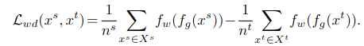

The **Domain Critic** approximates the Wasserstein distance by maximizing the formula above. 
The **Domain Critic** also has to obey a 1-Lipschitz constraint, which is enforced by subtracting the gradient penalty term below.

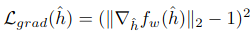

The final adversarial training objective by the **Alignment Component** is given as follows (g - **Feature Extractor**, w - **Domain Critic**):

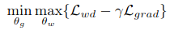

Note that **gamma** is set to 0 when optimizing the **Feature Extractor**. The **Domain Critic** is optimized automatically within the domain adaptation package.
The authors argue that minimizing the Wasserstein distance gives more stable gradients compared to DANN.


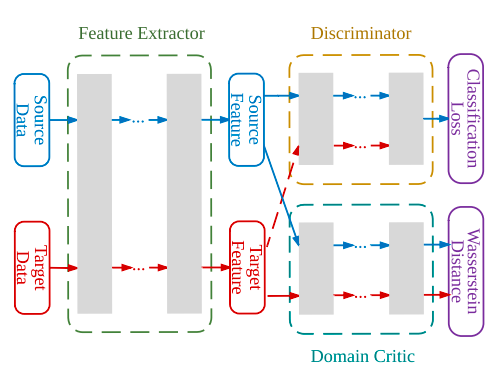

#### **Deep Joint Distribution Optimal Transport (DeepJDOT, da_type='jdot')** [9]

The crucial difference between **DeepJDot** and all other presented **Alignment Components** is that it aligns the joint distribution of
feature representation and labels between the two domain based on optimal transport. 
DeepJDot proceeds in two steps according to the formulas below.

Firstly, with fixed network parameters, for a batch of source and target samples the optimal coupling is found. This step matches
source and target domain samples that have both, a similar feature representation and label. Note that for target samples only
surrogate labels are used, since in unsupervised domain adaptation no labeled target domain samples are available.

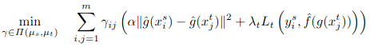

Secondly, using the coupling matrix, **Feature Extractor** and **Task Classifier** are updated. Source and target domain samples
with similar activations and labels are aligned.

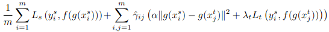

The coupling matrix is calculated automatically inside this domain adaptation package. Compared to other domain adaptation
methods, **DeepJDot** also requires source domain labels and target domain predictions. 


## MNIST to MNISTM Example

For demonstration purposes the repository contains a popular image classification example, called 
[MNIST to MNISTM](https://shawmask.github.io/domainadaptation/mnist_to_mnistm), which was introduced by Ganin et al. [6].
As shown in the image below, the MNIST [7] digits are the source domain images. The target domain is obtained by blending the
MNIST digits with real-world color photos from BSDS500 [8]. 

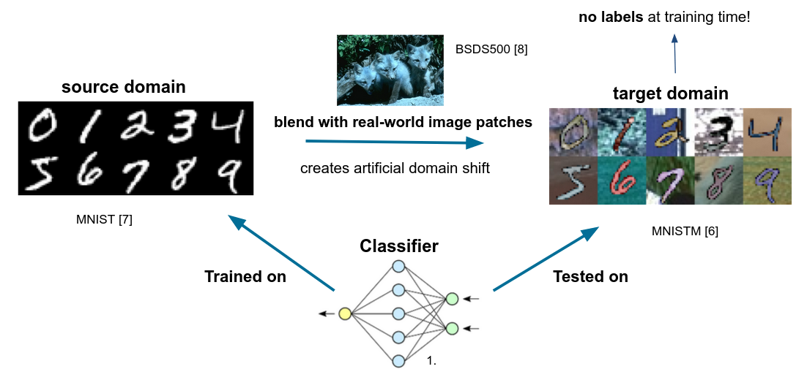

In the following we train on MNIST and test on MNISTM. We clearly see that those two domains are different in terms of 
feature distribution. To correct for this domain shift, we will use several domain adaptation algorithms from this package.

Please note that the commands below serve only as examples and do not contain tuned hyperparameter settings for the respective
domain adaptation algorithms. While some algorithms work out of the box, others would need more careful hyperparameter tuning.

#### Train on source domain only
`python train_da.py`

MNIST Test Accuracy | MNISTM Test Accuracy
--- | --- |
0.9919 | 0.6721

#### DANN [6]

`python train_da.py --da_type=dann`

MNIST Test Accuracy | MNISTM Test Accuracy
--- | --- |
0.9855 | 0.7480

`python train_da.py --da_type=dann --da_lambda=0.2 --all_embeds`

MNIST Test Accuracy | MNISTM Test Accuracy
--- | --- |
0.9893 | 0.7917

#### WDGRL [5]

`python train_da.py --da_type=wdgrl`

MNIST Test Accuracy | MNISTM Test Accuracy
--- | --- |
0.9861 | 0.8543

#### Deep-J-Dot [9]

`python train_da.py --da_type=jdot`

MNIST Test Accuracy | MNISTM Test Accuracy
--- | --- |
0.9888 | 0.7029

`python train_da.py --da_type=jdot --batch_size=128`

MNIST Test Accuracy | MNISTM Test Accuracy
--- | --- |
0.9888 | 0.7806

#### MMD [11]

`python train_da.py --da_type=mmd`

MNIST Test Accuracy | MNISTM Test Accuracy
--- | --- |
0.9898 | 0.6778

`python train_da.py --da_type=mmd --da_lambda=0.3 --all_embeds`

MNIST Test Accuracy | MNISTM Test Accuracy
--- | --- |
0.9912 | 0.7099

#### CMD [2]

`python train_da.py --da_type=cmd --da_lambda=0.01`

MNIST Test Accuracy | MNISTM Test Accuracy
--- | --- |
0.9919 | 0.6445

`python train_da.py --da_type=cmd --all_embeds --da_lambda=0.005`

MNIST Test Accuracy | MNISTM Test Accuracy
--- | --- |
0.9921 | 0.6649


#### SWD [10]

`python train_da.py --da_type=swd --da_lambda=0.1`

MNIST Test Accuracy | MNISTM Test Accuracy
--- | --- |
0.9929 | 0.6449

`python train_da.py --da_type=swd --da_lambda=5`

MNIST Test Accuracy | MNISTM Test Accuracy
--- | --- |
0.9917 | 0.6469

#### Coral [12]

`python train_da.py --da_type=coral`

MNIST Test Accuracy | MNISTM Test Accuracy
--- | --- |
0.9929 | 0.6754

`python train_da.py --da_type=coral --all_embeds --da_lambda=0.1`

MNIST Test Accuracy | MNISTM Test Accuracy
--- | --- |
0.9934 | 0.6771

## Usage Guide and API 

This Section describes the interface of the package in order to create a specific alignment component, get the domain 
adaptation loss and control the most important parameters. All the communication takes place via the module ``base.py``.

In the first step a ```DABase``` object is created given the following parameters:

    Parameters
    ----------
        embeds_size : list
            dimension of all the embeddings (activations) of the base network that are passed to this class
        embeds_idx : list, default=(-1,)
            indices of layer embeddings that should be used for calculating domain loss,
            layer 0 = first layer, layer -1 = last layer
        da_type : str, default='dann'
            specifies which type of alignment component is used
            options: 'mmd', 'cmd', 'swd', 'coral', 'dann', 'wdgrl', 'jdot'
        da_lambda : float, default=1.0
            trades of clf/reg loss and domain loss
            overall loss usually calculated as: loss = clf_loss + da_lambda * domain_loss
        lambda_auto_schedule: bool, default=False
            if schedule for lambda is applied (False => constant lambda)
        lambda_pretrain_steps: int, default=10000
            steps until lambda starts to increase
            steps => number of times get_da_loss(..) is called
            usually get_da_loss(..) is called once on every batch
        lambda_inc_steps : int, default=100000
            total number of steps until lambda reaches value specified in 'lambda_final'
        lambda_final : float, default=1.0
            final lambda value, if lambda_auto_schedule is 'True'
        num_domains : int, default=2
            number of different domains (usually 2 - source and target)
        num_classes : int, default=10
            number of classes of the underlying classification problem ('None'=regression problem)
        adv_config : dict, default={}
            contains parameters for configuring adversarial da net and optimizer (for wdgrl and dann)
            standard parameters are loaded from 'adv_conf.json' and updated with the provided dict
        da_spec_config : dict, default={}
            contains parameters specific to the domain adaptation methods
            standard parameters are loaded from 'da_spec_conf.json' and updated with the provided dict

Default values for ```adv_config``` and ```da_spec_config``` can be found in the following two files:
* ```adv_conf.json``` (specifies properties for adversarial network in case of 'dann' or 'wdgrl'):
```
{
    "da_optimizer_config": {
      "lr": 0.0001,
      "weight_decay": 0.001
    },
    "da_net_config": {
      "layers_width": [
        64,
        32
      ],
      "act_function": "relu",
      "dropout": 0.0
    }
}
```

* ```da_spec_conf.json``` (specifies parameters for a specific alignment component):
```
{
     "cmd": {
       "n_moments": 5
     },
     "coral": {
    
     },
     "dann": {
       "grad_scale_factor": 1.0,
       "auto_critic_update": false,
       "critic_iter": 5
     },
     "jdot": {
       "jdot_alpha": 10.0
     },
     "mmd": {
       "kernel_mul": 2,
       "kernel_num": 4,
       "fix_sigma": null
     },
     "swd": {
       "multiplier": 8,
       "p": 2
     },
     "wdgrl": {
       "gp_da_lambda": 10.0,
       "critic_iter": 5
     }
}
```

Passing a dictionary with the respective entries when initializing ```DABase``` overwrites the default configuration.

Using the created Alignment Component setup in the ```DABase``` object only requires calling the ```get_da_loss```-method
with the following specifications:

    Parameters
    ----------
        embeds : List[torch.Tensor]
            List of all embeddings from the base network. Those are filtered and sorted by 'embeds_idx'
        domain_labels : torch.Tensor
            List specifying whether a sample stems from source (=0) or target domain (=1)
        labels : torch.Tensor, default=None
            Labels only needed for 'jdot'; for target domain samples dummy labels can be passed
        predictions : torch.Tensor, default=None
            Predictions (output of classification or regression head) only needed for 'jdot'

    Returns
    -------
        loss : torch.Tensor
            loss produced by alignment component, including weighting by da_lambda
        da_info : dict
            additional stats that might be helpful to debug domain adaptation
            (e.g. loss produced per embedding or accuracy achieved by domain critic in case of 'dann')

#### Pseudo-Code example creating a custom WDGRL Alignment Component

```
from da.base import DABase

# configuring alignment component 
da_config = {
    "embeds_idx": [-1],
    "da_type": 'wdgrl',
    "da_lambda": 0.1,
    "da_spec_config": {
        "wdgrl": {
            "gp_da_lambda": 1.0,
            "critic_iter": 3
        }
    },
    "adv_config": {
        "da_optimizer_config": {
            "lr": 0.0001,
            "weight_decay": 0.001
        },
        "da_net_config": {
            "layers_width": [64, 32],
            "act_function": "relu",
            "dropout": 0.0
        }
    }
}

# creating model and requesting size of embeddings
clf_model = Net()
embeds_size = clf_model.get_embed_size()

# creating alignment component
da_model = DABase(embeds_size, **da_conf)

# calculate clf and alignment component loss and update network
for (src_X, src_y), (tgt_X, _) in dataloader:
    embeds, y_hat = clf_model(torch.cat((src_X, tgt_X)))
    clf_loss = criterion(y_hat[:len(src_y)], src_y) # loss based on source domain labels
    
    domain_labels = torch.cat((torch.zeros(len(src_X)), torch.ones(len(src_Y))))
    da_loss, _ = da.get_da_loss(embeds, domain_labels)
    
    loss = clf_loss + da_loss
    
    # optimize network based on loss here ...
```

The pseudo-code above creates an alignment component of type **wdgrl** with the following configuration: 
- The last entries in the list of embeddings and list of the embedding sizes are taken (embeds_idx = [-1])
- The value of 'da_lambda' was reduced and set to 0.1
- The two parameters 'gp_da_lambda' and 'critic_iter', which are specific to the method **wdgrl** are updated
- The adversarial network and its optimization schema is set in 'adv_config'

## Referenced Papers

[1] Wilson, G. & Cook, D.J. (2020) A Survey of Unsupervised Deep Domain Adaptation. ACM Trans. Intell. Syst. Technol. 11, 5, Article 51 (September 2020)

[2] Zellinger, W., Grubinger, T., Lughofer, E., Natschläger, T. & Saminger-Platz, S. (2017). Central Moment Discrepancy (CMD) for Domain-Invariant Representation Learning. International Conference on Learning Representations 2017.

[3] Lee, C. Y., Batra, T., Baig, M. H., & Ulbricht, D. (2019). Sliced wasserstein discrepancy for unsupervised domain adaptation. In Proceedings of the IEEE/CVF Conference on Computer Vision and Pattern Recognition (pp. 10285-10295)

[4] Ajakan, H., Germain, P., Larochelle, H., Laviolette, F., & Marchand, M. (2014). Domain-Adversarial Neural Networks. stat, 1050, 15.

[5] Shen, J., Qu, Y., Zhang, W., & Yu, Y. (2018, April). Wasserstein distance guided representation learning for domain adaptation. In Thirty-Second AAAI Conference on Artificial Intelligence.

[6] Ganin, Y., Ustinova, E., Ajakan, H., Germain, P., Larochelle, H., Laviolette, F., Marchand, M. & Lempitsky, V. (2016) Domain-adversarial training of neural networks. J. Mach. Learn. Res. 17, 1 (January 2016), 2096–2030.

[7] LeCun, Y., Bottou, L., Bengio, Y. & Haffner, P. (1998) Gradient-based learning applied to document recognition. Proceedings of the IEEE, 86(11):2278–2324, November 1998.

[8] Arbelaez, P., Maire, M., Fowlkes, C. & Malik, J. (2011) Contour detection and hierarchical image segmentation. IEEE Transaction Pattern Analysis and Machine Intelligence, 33, 2011.

[9] Damodara, B. B., Kellenberger, B., Flamary, R., Tuia, D. & Courty, N. (2018) DeepJDOT: Deep Joint Distribution Optimal Transport for Unsupervised Domain Adaptation. European Conference on Computer Vision 2018 (ECCV-2018)

[10] Lee, C. Y., Batra, T., Baig, M. H., & Ulbricht, D. (2019). Sliced wasserstein discrepancy for unsupervised domain adaptation. In Proceedings of the IEEE/CVF Conference on Computer Vision and Pattern Recognition (pp. 10285-10295)

[11] Tzeng, E., Hoffman, J., Zahng, N., Saenko, K. & Darell, T. (2014). Deep Domain Confusion: Maximizing for Domain Invariance. arXiv: 1412.3474

[12] Sun, B. & Saenko, K. (2016) Deep coral: Correlation alignment for deep domain adaptation. In Proceedings of Computer Vision – ECCV 2016 Workshops, Gang Hua and Hervé Jégou (Eds.). Springer International Publishing, Cham, 443–450.

[13] Ben-David, S., Blitzer, J., Crammer, K., Kulesza, A., Pereira, F. & Vaughan, J. (2010) A theory of learning from different domains. Mach. Learn. 79, 1–2 (May 2010), 151–175.


## Further Resources

1) https://commons.wikimedia.org/wiki/File:Neural_network.svg
